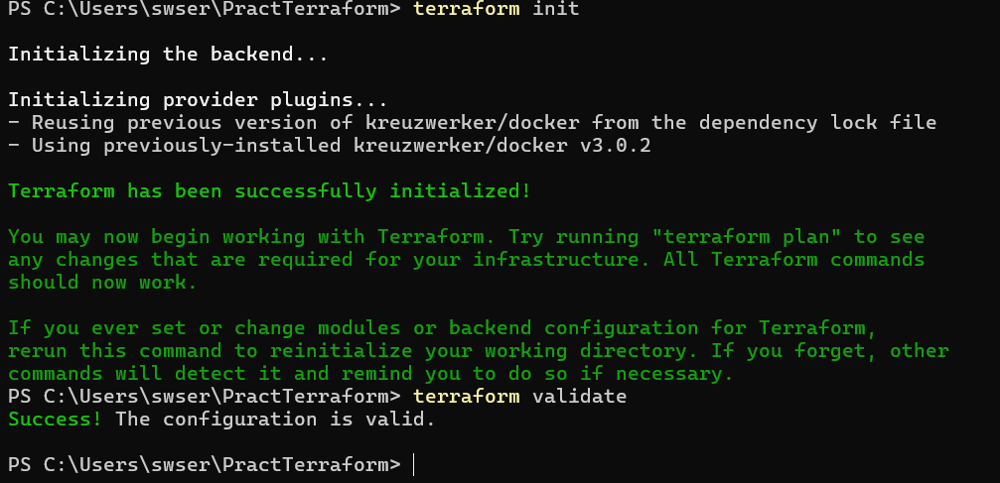
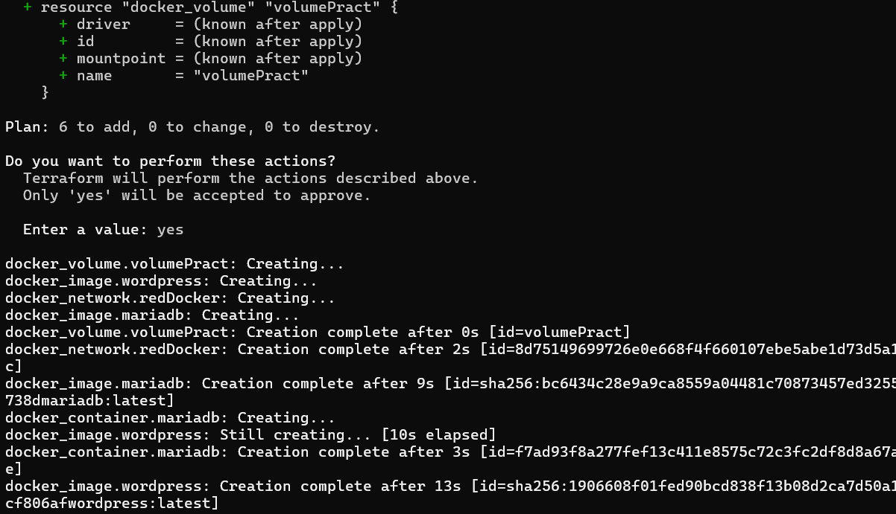
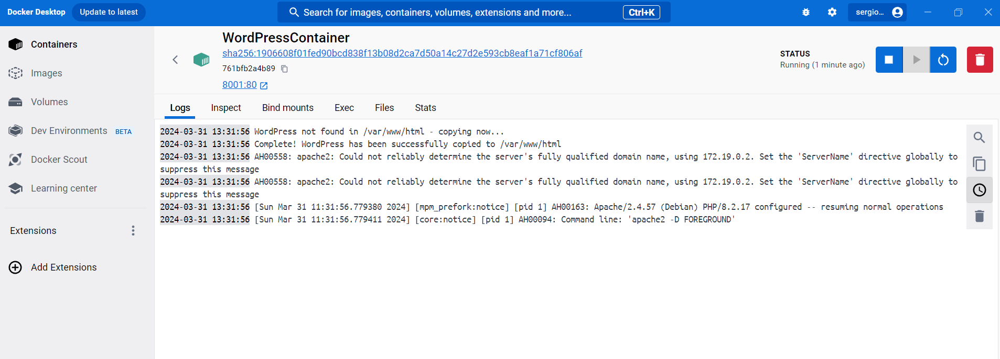
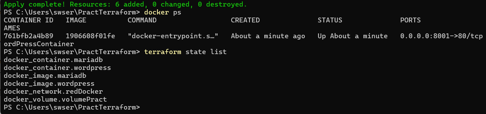
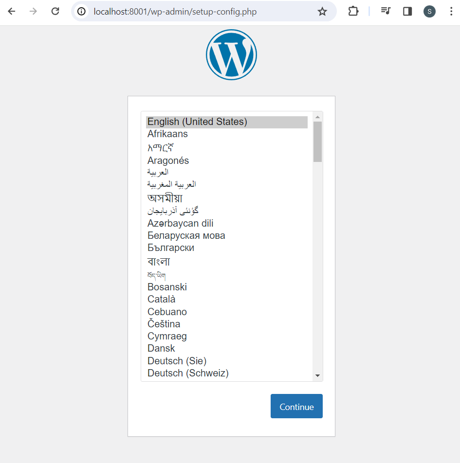

# Terraform #
# Enunciado #
1. Crea una infraestructura Docker personalizada utilizando Terraform.
2. La infraestructura debe contener un contenedor con una aplicación Wordpress y otro
contenedor con una base de datos MariaDB.
3. Deben estar conectados a una red Docker.
4. Debe existir un volumen para almacenar los datos de la base de datos y que no se
eliminen al destruir la infraestructura.
5. Deben usarse variables de entorno para configurar la aplicación Wordpress.
6. Debe existir un archivo de configuración variables.tf con las variables de entorno.

# Descripción del código #
# Fichero practTerraform.tf #
```
terraform {
  required_providers {
    docker = {
      source  = "kreuzwerker/docker"
      version = "~> 3.0.1"
    }
  }
}
```
Se define la configuración de Terraform especificando el proveedor de Docker que se utilizará. En este caso las versiones que sean 3.0.1 o superiores.

```
provider "docker" {
  host = "npipe:////.//pipe//docker_engine"
}
```
Se especifica la configuración del proveedor Docker. Si se hace en Windows añadir la línea --> host = "npipe:////.//pipe//docker_engine"

```
resource "docker_image" "wordpress" {
  name         = "wordpress:latest"
  keep_locally = false
}

resource "docker_image" "mariadb" {
  name         = "mariadb:latest"
  keep_locally = false
}

```
Se configuran las imágenes de wordpress y mariadb que se utilizan en Docker. Se especifica que se utilice la última versión y que no se guarde localmente en nuestra máquina después de su uso

```
resource "docker_volume" "volumePract" {
  name = "volumePract"
}
```
Se define el volumen que se utiliza la persistencia de la información

```
resource "docker_network" "redDocker" {
  name = "redDocker"
}
```
Se define la red a través de la cual se comunicarán los contenedores de wordpress y mariadb.

```
resource "docker_container" "wordpress" {
  image = docker_image.wordpress.image_id
  name  = var.container_name
  ports {
    internal = 80
    external = 8001
  }

  depends_on = [docker_container.mariadb]

  env = [
    "WORDPRESS_DB_HOST  = mariadb",
    "WORDPRESS_DB_NAME  = wordpress",
    "WORDPRESS_DB_USER  = root",
    "WORDPRESS_DB_PASSWORD  = example"
  ]

  networks_advanced {
    name = docker_network.redDocker.name
  }

  volumes {
    volume_name    = docker_volume.volumePract.name
    container_path = "/var/www/html/wp-content"
  }
}
```
Se especifica la configuración del container que contendrá esa imagen de wordpress anteriormente declarada. 
image = docker_image.wordpress.image_id --> utiliza la imagen de wordpress declarada en docker_image antes.
name  = var.container_name --> utiliza la variable de entorno definida en el fichero variables.tf
En el apartado de ports se mapea el puerto 80 del container con el puerto 8001 de nuestra máquina (localhost) para poder posteriormente visualizarlo
depends_on = [docker_container.mariadb] --> Se declara que se construya antes el container de mariadb antes que el de wordpress ya que éste depende de mariadb
En el apartado de env se declaran las variables de entorno que contiene el wordpress que hemos definido (similar a la práctica de Docker)
En el apartado de networks_advanced se asigna esa red a través de la cual se comunicarán los containers previamente declarada
En el apartado de volumes se asigna la ruta en la que se almacenarán esos datos y el nombre del mismo previamente definido
```
resource "docker_container" "mariadb" {
  image = docker_image.mariadb.image_id
  name  = "mariadb"

  env = [
    "MYSQL_DATABASE = wordpress",
    "MYSQL_USER = root",
    "MYSQL_PASSWORD = example",
    "MYSQL_ROOT_PASSWORD = root"
  ]

  networks_advanced {
    name = docker_network.redDocker.name
  }

  volumes {
    volume_name    = docker_volume.volumePract.name
    container_path = "/var/lib/mysql"
  }
}
```
image = docker_image.mariadb.image_id --> utiliza la imagen de mariadb declarada en docker_image antes.
name  = "mariadb" --> se declara el nombre que tendrá ese container
En el apartado de env se declaran las variables de entorno que contiene el container de mariadb (similar a la práctica de Docker)
En el apartado de networks_advanced se asigna esa red a través de la cual se comunicarán los containers previamente declarada
En el apartado de volumes se asigna la ruta en la que se almacenarán esos datos y el nombre del mismo previamente definido
# Fichero variables.tf #
```
variable "container_name" {
  description = "Value of the name for the Docker container"
  type        = string
  default     = "WordPressContainer"
}
```
Se declara la variable que especificará el nombre que llevará el container de wordpress.
description = "Value of the name for the Docker container" --> Simple descripción para declarar qué se está configurando
type        = string --> una cadena de texto
default     = "WordPressContainer" --> si no se especifica ningún nombre, el predeterminado será WordPressContainer

# Despliegue de Terraform #
1. Se inicia Docker Desktop y se ejecuta terraform init

2. Se escribe el comando plan y apply para aplicar cualquier cambio y su ejecución



